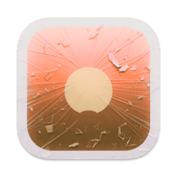

    
    <h1 align="center"><code style="text-shadow: 0px 3px 10px rgba(8, 0, 6, 0.35); font-size: 3rem; font-family: ui-monospace, Menlo, monospace; font-weight: 800; background: transparent; color: #4d3e56; padding: 0.2rem 0.2rem; border-radius: 6px">Cling</code></h1>
    <h4 align="center" style="padding: 0; margin: 0; font-family: ui-monospace, monospace;">Instant fuzzy find any file</h4>
    <h6 align="center" style="padding: 0; margin: 0; font-family: ui-monospace, monospace; font-weight: 400;">Act on it in the same instant</h6>

    

### Installation

- Download the app from the [website](https://lowtechguys.com/cling) and drag it to your `Applications` folder
- *Homebrew will be available once this repository gains [at least 75 stars](https://docs.brew.sh/Acceptable-Casks#rejected-casks)*

